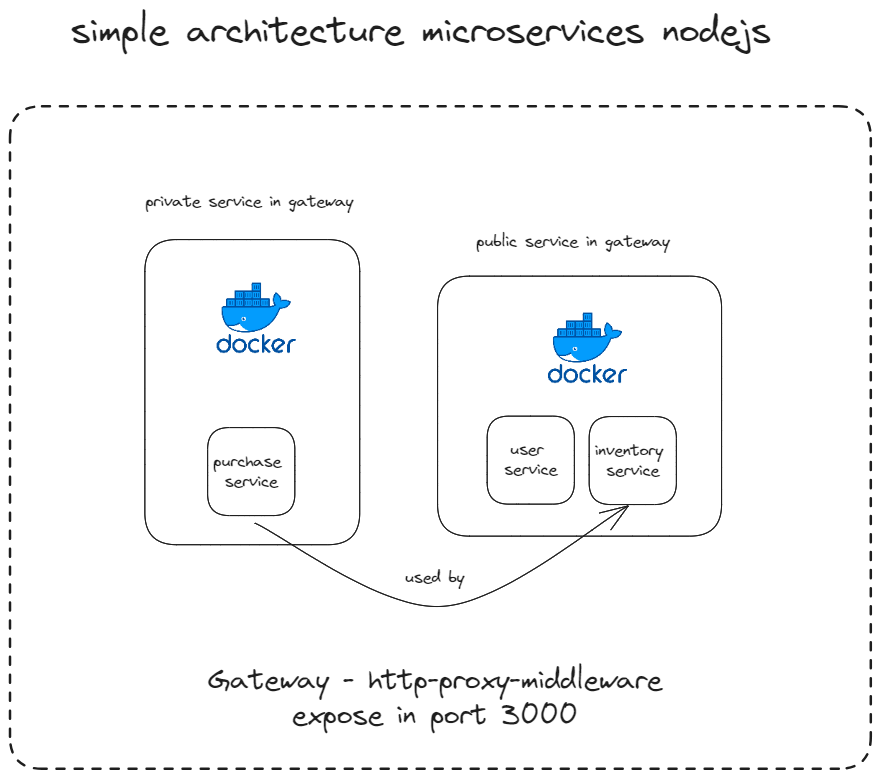

## **Microservices Exercise - Node.js and Docker**

## Architecture Overview



## **Overview**

This repository contains a simple microservices project built using Node.js and Docker. The project consists of multiple services, each encapsulated within a Docker container, allowing for easy deployment, scalability, and isolation.

## **Services**

### **1\. User Service**

- **Description:** Manages user-related functionalities.
- **Port:** 3001
- **Environment Variable:**
  - **PORT=3001**

### **2\. Inventory Service**

- **Description:** Handles inventory operations.
- **Port:** 3002
- **Environment Variables:**
  - **PORT=3002**
  - **SERVICE_PURCHASE=purchase:3003**

### **3\. Purchase Service**

- **Description:** Deals with purchase-related tasks. (can't access in public)
- **Port:** 3003
- **Environment Variable:**
  - **PORT=3003**

### **4\. Gateway**

- **Description:** Acts as an entry point, routing requests to appropriate services.
- **Port:** 3000 (Exposed to the host)
- **Dependencies:**
  - User Service
  - Inventory Service
  - Purchase Service
- **Environment Variables:**
  - **PORT=3000**
  - **SERVICE_USER=user:3001**
  - **SERVICE_INVENTORY=inventory:3002**

## **Project Structure**

- **service-user/**: User service source code and Dockerfile.
- **service-inventory/**: Inventory service source code and Dockerfile.
- **service-purchase/**: Purchase service source code and Dockerfile.
- **service-gateway/**: Gateway service source code and Dockerfile.

## **Getting Started**

1.  Clone the repository:

    ```bash
      git clone https://github.com/Alien-404/microservice-nodejs-exercise
    ```

2.  Build and run the services:

    ```bash
      docker-compose up -d
    ```

3.  Access the gateway service:

    Open your web browser and go to [http://localhost:3000](http://localhost:3000/).

## **Notes**

- This project serves as a learning exercise for understanding microservices architecture using Node.js and Docker.
- Each service is encapsulated in a Docker container, providing isolation and ease of deployment.
- The **docker-compose.yml** file orchestrates the deployment of services and defines the network configurations.

Feel free to explore the code and experiment with microservices communication and Docker deployment in this project!
